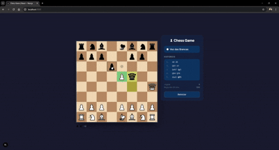

# ♟ Chess Game

> Jogo de xadrez completo construído com **Next.js**, **React**, **TypeScript** e **Tailwind CSS**.
> Desenvolvido como projeto educacional passo a passo.

---

## Demonstração visual

<div align="center">
  
</div>

<p align="center">
  <a href="https://xadrez-react-next.vercel.app/" target="_blank">
    
  </a>
</p>


---

## Stack

| Camada        | Tecnologia                                                  | Versão |
| ------------- | ----------------------------------------------------------- | ------ |
| Framework     | [Next.js](https://nextjs.org/) (App Router)                 | 16     |
| UI            | [React](https://react.dev/)                                 | 19     |
| Linguagem     | [TypeScript](https://www.typescriptlang.org/)               | 5      |
| Estilização   | [Tailwind CSS](https://tailwindcss.com/)                    | v4     |
| Estado global | [Zustand](https://zustand-demo.pmnd.rs/)                    | 5      |
| Ícones        | [Lucide React](https://lucide.dev/)                         | latest |

---

## Funcionalidades

- Tabuleiro visual responsivo com coordenadas (a–h, 1–8)
- Movimentos válidos para todas as 6 peças conforme regras oficiais
- Destaque de jogadas possíveis ao selecionar uma peça
- Sistema de turnos — brancas sempre jogam primeiro
- Captura de peças com exibição das peças capturadas por cada lado
- Vantagem de material calculada e exibida em tempo real
- Xeque — rei destacado em vermelho com animação pulsante
- Xeque-mate e afogamento — jogo encerra com mensagem de resultado
- Roque kingside `O-O` e queenside `O-O-O`
- En passant
- Promoção de peão com modal de seleção de peça
- Histórico de jogadas em notação algébrica padrão
- Contador da regra dos 50 movimentos
- Reiniciar partida a qualquer momento

---

## Pré-requisitos

- [Node.js](https://nodejs.org/) **18.17** ou superior
- **npm**, **pnpm** ou **yarn**

```bash
node --version   # deve ser v18.17.0 ou superior
npm --version    # deve ser 9.x ou superior
```

---

## Instalação

### 1. Clone o repositório

```bash
git clone https://github.com/seu-usuario/chess-game.git
cd chess-game/chess-game
```

### 2. Instale as dependências

```bash
npm install
```

### 3. Inicie o servidor de desenvolvimento

```bash
npm run dev
```

Acesse [http://localhost:3000](http://localhost:3000) no navegador.

### 4. Build de produção

```bash
npm run build
npm run start
```

---

## Como jogar

```
PASSO 1 — Selecione uma peça
──────────────────────────────────────────
  Clique em qualquer peça da sua cor.
  Ela fica destacada em verde.
  Pontos aparecem nas casas disponíveis.
  Anéis aparecem nas casas de captura.

PASSO 2 — Mova a peça
──────────────────────────────────────────
  Clique em uma casa destacada.
  A jogada é executada e o turno muda.

  Clique em outra peça aliada para
  trocar a seleção sem perder o turno.

  Clique fora das casas válidas para
  cancelar a seleção.

PASSO 3 — Movimentos especiais
──────────────────────────────────────────
  ROQUE:      Selecione o rei e clique
              2 casas para o lado.

  EN PASSANT: O destino aparece
              automaticamente quando
              disponível.

  PROMOÇÃO:   Leve um peão até a última
              fileira. Um modal aparecerá
              para escolher a peça.
```

### Indicadores visuais

| Destaque          | Significado                           |
| ----------------- | ------------------------------------- |
| Verde             | Peça selecionada                      |
| Ponto cinza       | Casa vazia disponível para mover      |
| Anel cinza        | Casa ocupada disponível para capturar |
| Amarelo           | Origem e destino do último movimento  |
| Vermelho pulsante | Rei em xeque                          |

---


**Princípios aplicados:**

- A **engine** é 100% pura — sem efeitos colaterais, sem estado externo
- O **store** é a única fonte de verdade — componentes só leem e disparam ações
- Os **componentes** são apresentacionais — recebem props e renderizam

---


<div align="center">
  Feito com ♟ e TypeScript
</div>
